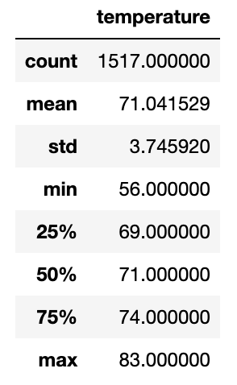
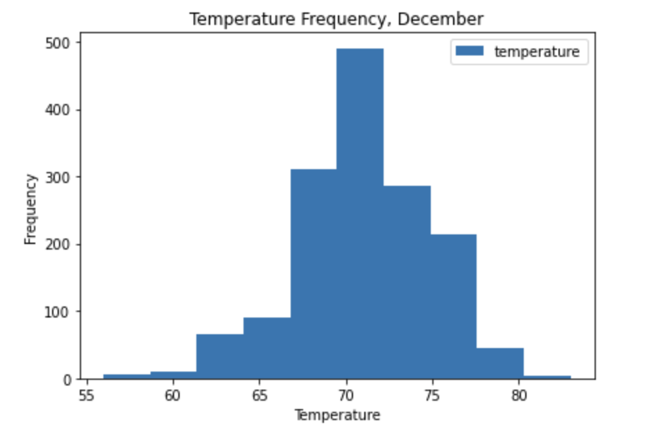
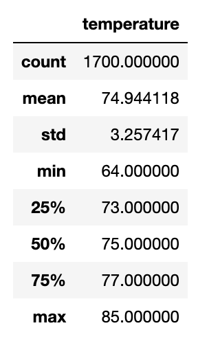
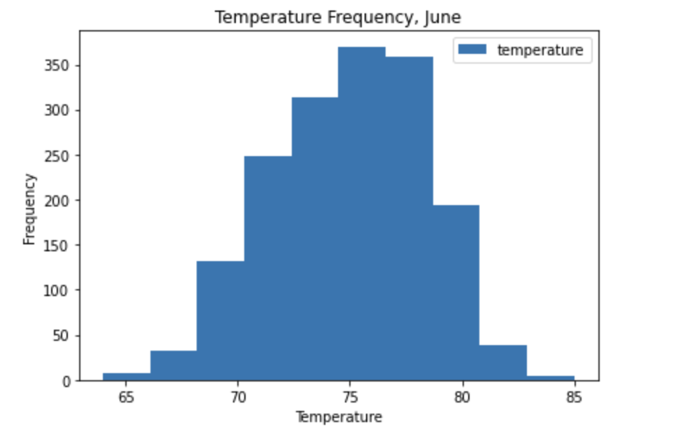
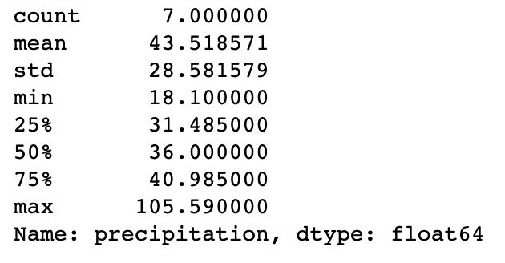
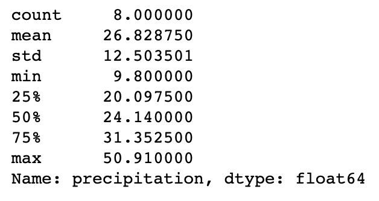

# Surfs Up Project

## Overview
For this project I analyzed historical weather data from the island of Oahu using SQLite, SQLAlchemy, and Python to determine the optimal time of year to open up a retail business on the island. For my analysis I chose to look at temperature trends in the month of December and the month of June over multiple years in order to determine if business could be sustainable all year round.

## Results
As would be expected, the temperatures in December are cooler than in June - even in the tropical island of Oahu, HI. With my analysis, there are three key takeaways that highlight the difference in temperature. 

1. The first takeaway is that the range of temperature for June is 22 degrees fahrenheit (85 degrees minus 64 degrees). While in December, the range is 27 degrees fahrenheit (83 degrees minus 56 degrees). It's clear to see that June temperatures vary less than December's.
2. With the range being so much larger for December, it comes as no surprise to see that the lowest recorded temperature in the June dataset is 64 degrees. Meanwhile the lowest recorded temperature in the December dataset is as low as 56 degrees. This is a siginificant difference and will definitely play a key role in determining monthly business trends/sales.
3. We can see that the average temperature in June is roughly 75 degrees fahrenheit, while the average temperature in December is 71 degrees fahrenheit. While at first glance, this may not seem like much, in the tropics this can be a big change and has potential to affect business.

**December Temperature Discription**

**December Temperature Distribution**

**June Temperature Discription**

**June Temperature Distribution**

## Summary
After analyzing data on the temperature of Oahu during the months of June and December across multiple years, we can conclude that while there are some stark differences, overall the temperature stays at around 71-75 degrees. While this will have some affect on business, I don't believe it will be strong enough to negatively affect sales. 

However, in tropical islands such as Hawaii, it's not so much the temperature that can affect a storefront business, but rather the amount of rain. Tropical islands tend to have two "seasons": a wet and a dry season. December is considered the peak of the wet season and June is considered the peak of the dry season. To better showcase this, I ran an extra analysis on total precipitation levels for December and June from 2010 till 2016. In the photos seen bellow, it is clear to see that over these 6 years, December got an average of 43inches of rain while June got an average of about 26inches of rain. This massive difference means sales in December, and the rainy season as a whole, may take a significant dip. 

**December Precipitation Discription**

**June Precipitation Discription**

